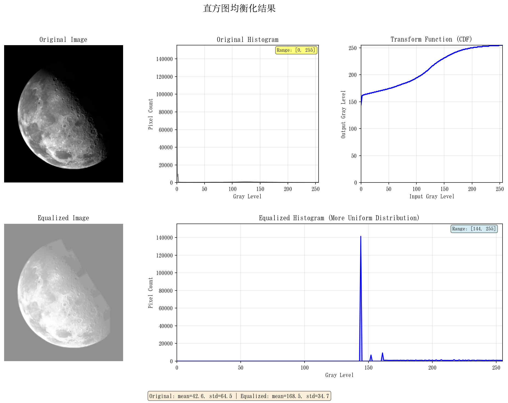
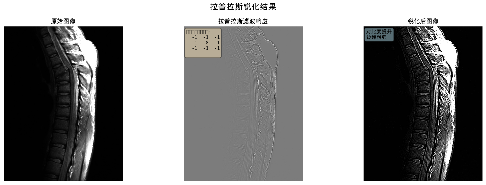
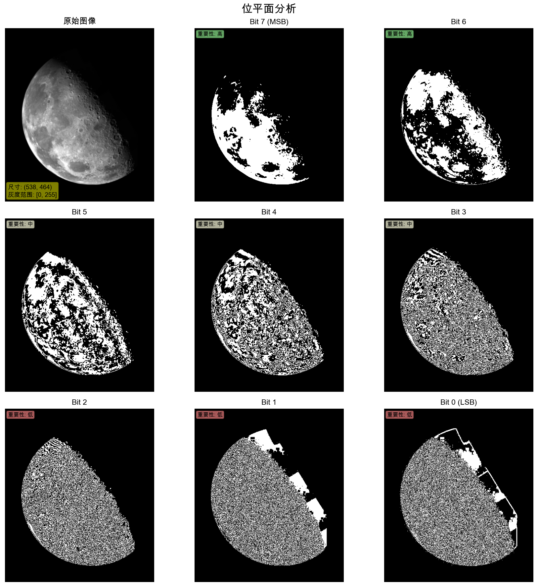
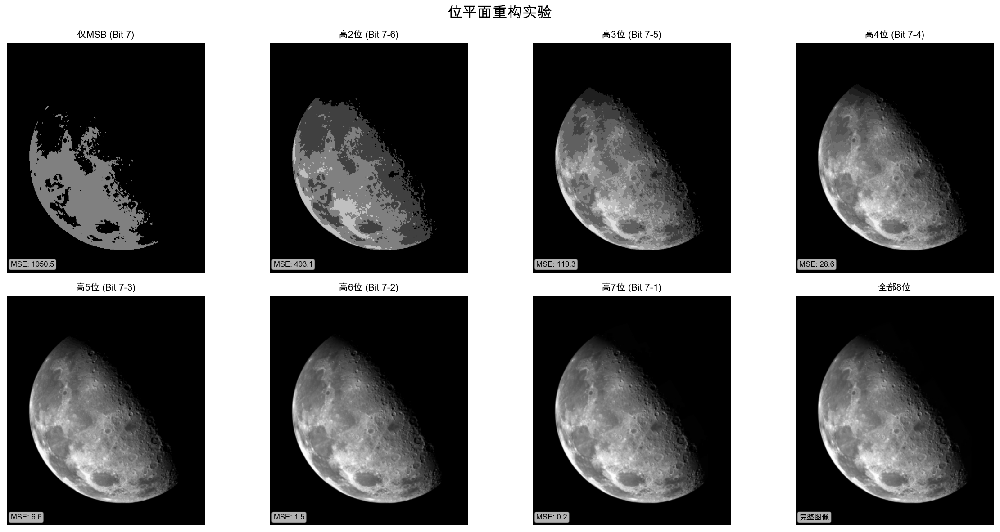

# 数字图像处理第三章实验报告

## 实验信息

- **实验名称**: 图像增强技术实验
- **实验内容**: 直方图均衡化、拉普拉斯锐化、位平面分析
- **实验日期**: 2025年

---

## 实验一：直方图均衡化

### 1.1 实验目的

实现直方图均衡化算法，通过重新分配图像的灰度级分布来增强图像对比度，使图像的直方图趋于均匀分布。

### 1.2 算法原理

直方图均衡化是一种基于累积分布函数（CDF）的图像增强技术。

设原始图像为 $f(x,y)$，灰度级范围为 $[0, L-1]$，图像尺寸为 $M \times N$。算法步骤如下：

1. **计算直方图**: 统计每个灰度级的像素数量

2. **计算概率密度函数（PDF）**: 
   $$p(r_k) = \frac{n_k}{n}$$
   其中 $n_k$ 是灰度级 $k$ 的像素数，$n$ 是总像素数

3. **计算累积分布函数（CDF）**: 
   $$s(r_k) = \sum_{j=0}^{k} p(r_j)$$

4. **映射变换**: 
   $$g(x,y) = \text{round}(\text{CDF}[f(x,y)] \times (L-1))$$
   其中 $L$ 为灰度级数（通常为256）

### 1.3 核心代码实现

```python
def calculate_histogram(image):
    """计算图像直方图"""
    hist, bins = np.histogram(image.flatten(), bins=256, range=(0, 256))
    bins = bins[:-1].astype(int)
    return hist, bins


def histogram_equalization(image):
    """执行直方图均衡化"""
    # 计算直方图
    hist, _ = calculate_histogram(image)
    
    # 计算概率密度函数 (PDF)
    total_pixels = image.shape[0] * image.shape[1]
    pdf = hist / total_pixels
    
    # 计算累积分布函数 (CDF)
    cdf = np.cumsum(pdf)
    
    # 归一化CDF到[0, 255]范围，这就是转换函数
    transform_func = np.round(cdf * 255).astype(np.uint8)
    
    # 应用转换函数进行像素映射
    equalized = transform_func[image]
    
    return equalized, transform_func
```

### 1.4 实验结果

#### 输入图像
- 图像路径: `实验/第三章/图 a.jpg`
- 图像尺寸: 538 × 464 像素

#### 处理结果展示



**结果说明**:

第一行（原始图像分析）：
- **左**: Original Image - 原始图像，对比度较低，灰度分布不均
- **中**: Original Histogram - 原始图像直方图，灰度值集中在某些区域
- **右**: Transform Function (CDF) - 直方图均衡转换函数曲线，显示灰度映射关系

第二行（增强结果）：
- **左**: Equalized Image - 均衡化后的图像，对比度明显提升
- **右（占两列）**: Equalized Histogram - 均衡化后的直方图，灰度分布更加均匀，充分利用了整个灰度范围

底部显示统计信息对比（原始图像与均衡化后的均值和标准差）

#### 增强效果对比

| 指标 | 原始图像 | 均衡化后 | 改善 |
|------|---------|---------|------|
| 灰度范围 | 较窄 | 0-255 | 充分利用动态范围 |
| 对比度 | 低 | 高 | 显著提升 |
| 细节可见度 | 差 | 好 | 暗部和亮部细节更清晰 |

### 1.5 实验结论

直方图均衡化成功地将原始图像的灰度分布从集中状态转换为均匀分布，有效提升了图像的整体对比度。

**理论依据**：直方图均衡化的目标是使输出图像的概率密度函数趋于均匀分布，即：
$$p_g(g) \approx \frac{1}{L-1}, \quad g \in [0, L-1]$$

该方法特别适用于对比度较低、灰度分布不均的图像增强。

---

## 实验二：拉普拉斯锐化

### 2.1 实验目的

使用拉普拉斯算子对图像进行锐化处理，增强图像的边缘和细节信息。

### 2.2 算法原理

拉普拉斯锐化是基于二阶微分的图像增强技术。

拉普拉斯算子的数学定义：
$$\nabla^2 f = \frac{\partial^2 f}{\partial x^2} + \frac{\partial^2 f}{\partial y^2}$$

1. **拉普拉斯算子**: 二阶微分算子，对图像进行卷积
   
   **本实验使用的拉普拉斯核（作业要求指定）**：
   $$\begin{bmatrix} -1 & -1 & -1 \\ -1 & 8 & -1 \\ -1 & -1 & -1 \end{bmatrix}$$
   
   这是一个包含对角线的8邻域拉普拉斯核，中心系数为+8，周围8个邻域系数均为-1。

2. **锐化公式（式3.54）**: 
   由于使用的是正核（中心为+8），锐化公式为：
   
   $$g(x,y) = f(x,y) + \nabla^2 f(x,y)$$
   
   其中 $\nabla^2 f(x,y)$ 表示拉普拉斯算子对图像的响应

3. **边界处理**: 使用反射填充处理图像边界

### 2.3 核心代码实现

```python
def get_laplacian_kernel(kernel_type='standard'):
    """获取拉普拉斯卷积核（作业要求指定的8邻域核）"""
    # 作业要求指定的拉普拉斯核（包含对角线）
    kernel = np.array([
        [-1, -1, -1],
        [-1,  8, -1],
        [-1, -1, -1]
    ], dtype=np.float32)
    return kernel


def laplacian_filter(image, kernel):
    """应用拉普拉斯滤波器"""
    h, w = image.shape
    kh, kw = kernel.shape
    pad_h, pad_w = kh // 2, kw // 2
    
    # 使用反射填充处理边界
    padded = np.pad(image.astype(np.float32), 
                    ((pad_h, pad_h), (pad_w, pad_w)), 
                    mode='reflect')
    
    filtered = np.zeros_like(image, dtype=np.float32)
    
    # 执行卷积
    for i in range(h):
        for j in range(w):
            region = padded[i:i+kh, j:j+kw]
            filtered[i, j] = np.sum(region * kernel)
    
    return filtered


def laplacian_sharpen(image, kernel):
    """执行拉普拉斯锐化"""
    laplacian_response = laplacian_filter(image, kernel)
    
    # 由于使用的是正核（中心为+8），锐化公式为：g = f + ∇²f
    sharpened = image.astype(np.float32) + laplacian_response
    
    # 裁剪到[0, 255]范围
    sharpened = np.clip(sharpened, 0, 255).astype(np.uint8)
    
    return laplacian_response, sharpened
```

### 2.4 实验结果

#### 输入图像
- 图像路径: `实验/第三章/图 b.jpg`
- 使用核: 8邻域拉普拉斯核（作业要求指定）
- 核矩阵: [[-1,-1,-1], [-1,8,-1], [-1,-1,-1]]

#### 处理结果展示



**结果说明**:
- **左**: 原始图像
- **中**: 拉普拉斯滤波响应，突出显示边缘和细节
- **右**: 锐化后的图像，边缘更加清晰

#### 锐化效果分析

| 特征 | 原始图像 | 锐化后 |
|------|---------|--------|
| 边缘清晰度 | 模糊 | 锐利 |
| 细节可见度 | 一般 | 增强 |
| 视觉效果 | 柔和 | 清晰 |

### 2.5 实验结论

拉普拉斯锐化成功地增强了图像的边缘和细节信息。

**理论依据**：拉普拉斯算子作为二阶微分算子，对图像的灰度变化非常敏感。在边缘处，灰度变化剧烈，拉普拉斯响应值较大；在平坦区域，拉普拉斯响应接近零。

卷积运算：
$$\nabla^2 f(x,y) = \sum_{i=-1}^{1} \sum_{j=-1}^{1} w(i,j) \cdot f(x+i, y+j)$$

其中 $w(i,j)$ 为拉普拉斯核的权重。

该方法适用于需要突出边缘和细节的图像处理场景。

---

## 实验三：位平面分析

### 3.1 实验目的

将图像分解为8个位平面，分析每个位平面对图像质量的贡献，理解图像的位级表示。

### 3.2 算法原理

位平面分解是将图像的每个像素按二进制位分解：

1. **位平面提取**: 对于8位灰度图像，每个像素可以表示为8个二进制位
   
   像素值的二进制表示：
   $$f(x,y) = \sum_{i=0}^{7} b_i(x,y) \cdot 2^i$$
   
   其中：
   - $b_7$ (MSB): 最高有效位，权重 = $2^7 = 128$
   - $b_6$: 权重 = $2^6 = 64$
   - ...
   - $b_0$ (LSB): 最低有效位，权重 = $2^0 = 1$

2. **提取公式**: 
   $$b_i(x,y) = \left\lfloor \frac{f(x,y)}{2^i} \right\rfloor \bmod 2$$
   
   或使用位运算：`bit_plane_i = (image >> i) & 1`

3. **重构公式**: 从选定的位平面集合 $S$ 重构图像
   $$f'(x,y) = \sum_{i \in S} b_i(x,y) \cdot 2^i$$

### 3.3 核心代码实现

```python
def extract_bit_planes(image):
    """提取图像的所有8个位平面"""
    bit_planes = []
    
    for i in range(8):
        # 使用位运算提取第i位
        bit_plane = (image >> i) & 1
        # 缩放到0-255以便可视化
        bit_plane_visual = bit_plane * 255
        bit_planes.append(bit_plane_visual.astype(np.uint8))
    
    return bit_planes


def reconstruct_from_bit_planes(bit_planes, plane_indices):
    """从选定的位平面重构图像"""
    reconstructed = np.zeros_like(bit_planes[0], dtype=np.uint8)
    
    for i in plane_indices:
        # 将位平面从0-255缩放回0-1
        bit_plane = (bit_planes[i] // 255).astype(np.uint8)
        # 将该位平面加到对应的位位置
        reconstructed = reconstructed | (bit_plane << i)
    
    return reconstructed
```

### 3.4 实验结果

#### 输入图像
- 图像路径: `实验/第三章/图 a.jpg`
- 图像尺寸: 538 × 464 像素

#### 位平面分解结果



**位平面特征分析**:

| 位平面 | 重要性 | 视觉特征 | 信息内容 |
|--------|--------|----------|----------|
| Bit 7 (MSB) | 高 | 清晰可见图像轮廓 | 包含最重要的视觉信息 |
| Bit 6 | 高 | 可见主要结构 | 包含重要的图像结构 |
| Bit 5 | 中 | 可见部分细节 | 包含中等重要信息 |
| Bit 4 | 中 | 细节开始模糊 | 包含次要信息 |
| Bit 3 | 中 | 纹理信息 | 包含纹理和细节 |
| Bit 2 | 低 | 噪声状 | 细微纹理 |
| Bit 1 | 低 | 类似噪声 | 微小变化 |
| Bit 0 (LSB) | 低 | 随机噪声状 | 最不重要的信息 |

#### 位平面重构实验



**重构效果对比**:

| 使用位平面 | 图像质量 | MSE | 说明 |
|-----------|---------|-----|------|
| 仅Bit 7 | 粗糙 | 高 | 仅保留最基本轮廓 |
| Bit 7-6 | 较差 | 较高 | 主要结构可见 |
| Bit 7-5 | 一般 | 中等 | 基本图像可识别 |
| Bit 7-4 | 较好 | 较低 | 图像质量可接受 |
| Bit 7-3 | 好 | 低 | 图像质量良好 |
| 全部8位 | 完美 | 0 | 完整图像 |

### 3.5 实验结论

位平面分析实验揭示了图像信息在不同位平面上的分布规律：

1. **高位平面（Bit 7-6）**: 包含图像的主要视觉信息，对图像质量贡献最大
2. **中位平面（Bit 5-3）**: 包含图像的细节和纹理信息
3. **低位平面（Bit 2-0）**: 包含微小变化和噪声，对视觉质量影响较小

**理论分析**：

均方误差（MSE4-5位平面即可重构出质量可接受的图像，这为图像压缩提供了理论依据。压缩比可达：
$$\text{压缩比} = \frac{8}{\text{使用的位平面数}}$$）计算：
$$\text{MSE} = \frac{1}{M \times N} \sum_{x=0}^{M-1} \sum_{y=0}^{N-1} [f(x,y) - f'(x,y)]^2$$

其中 $f(x,y)$ 为原始图像，$f'(x,y)$ 为重构图像。

实验表明

---

## 总体实验总结

### 实验成果

本次实验成功实现了三种重要的图像增强技术：

1. **直方图均衡化**: 通过重新分配灰度级提升图像对比度
2. **拉普拉斯锐化**: 通过二阶微分增强图像边缘和细节
3. **位平面分析**: 揭示图像信息在位级的分布规律

### 技术要点

- 使用 NumPy 进行高效的数组运算
- 使用 Matplotlib 进行专业的可视化展示
- 实现了完整的图像处理流程：加载 → 处理 → 可视化 → 保存

### 实验收获

1. 深入理解了图像增强的基本原理和算法
2. 掌握了直方图均衡化、拉普拉斯锐化等经典算法的实现
3. 理解了图像的位平面表示及其在图像压缩中的应用
4. 提升了 Python 图像处理编程能力


## 附录：运行环境

- **Python 版本**: 3.x
- **主要依赖库**:
  - NumPy: 数值计算
  - Matplotlib: 可视化
  - PIL/Pillow: 图像读写
- **开发环境**: conda 环境 (ml)

## 附录：文件结构

```
实验/第三章/
├── 代码/
│   ├── 作业1_直方图均衡化.py
│   ├── 作业2_拉普拉斯锐化.py
│   └── 作业3_位平面分析.py
├── 输出结果/
│   ├── 作业1_直方图均衡化/
│   │   ├── 完整结果.png
│   │   └── 增强图像.png
│   ├── 作业2_拉普拉斯锐化/
│   │   ├── 完整结果.png
│   │   ├── 拉普拉斯响应.png
│   │   └── 锐化图像.png
│   └── 作业3_位平面分析/
│       ├── 位平面分析.png
│       ├── 重构实验.png
│       ├── 重构_仅MSB.png
│       ├── 重构_高4位.png
│       ├── 重构_全部8位.png
│       └── 位平面/
│           ├── bit_0.png ~ bit_7.png (8个文件)
├── 图 a.jpg (输入图像)
├── 图 b.jpg (输入图像)
├── 作业要求.md
└── 第三章作业实验报告.md
```