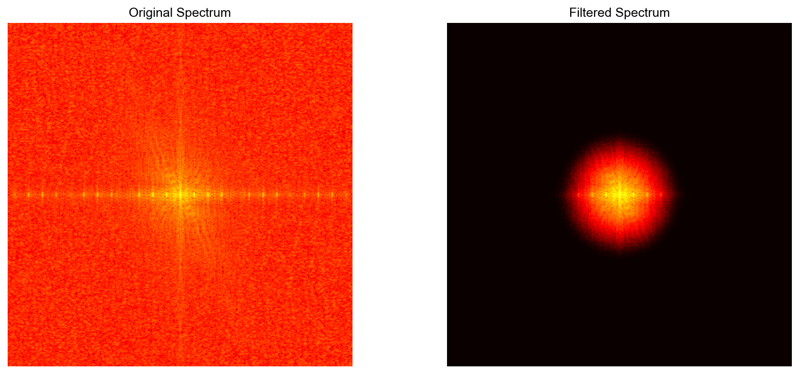

# 数字图像处理第四章实验报告
[23336128]
[梁力航]
## 实验信息

- **实验名称**: 频率域滤波技术实验
- **实验内容**: 二维快速傅里叶变换、高斯低通滤波
- **实验日期**: 2025年

---

## 实验一：二维快速傅里叶变换

### 1.1 实验目的

实现二维快速傅里叶变换（2D FFT）及其逆变换，将图像从空间域转换到频率域进行分析，理解图像的频率特性，并通过逆变换验证变换的正确性。

### 1.2 算法原理

傅里叶变换是图像处理中最重要的变换之一，它将空间域的图像转换到频率域，揭示图像的频率成分。

#### 二维离散傅里叶变换（2D DFT）

对于 $M \times N$ 的图像 $f(x,y)$，其二维离散傅里叶变换定义为：

$$F(u,v) = \sum_{x=0}^{M-1} \sum_{y=0}^{N-1} f(x,y) e^{-j2\pi(\frac{ux}{M} + \frac{vy}{N})}$$

其中：
- $u = 0, 1, 2, ..., M-1$（频率域的行坐标）
- $v = 0, 1, 2, ..., N-1$（频率域的列坐标）
- $j = \sqrt{-1}$（虚数单位）

#### 二维逆傅里叶变换（2D IDFT）

$$f(x,y) = \frac{1}{MN} \sum_{u=0}^{M-1} \sum_{v=0}^{N-1} F(u,v) e^{j2\pi(\frac{ux}{M} + \frac{vy}{N})}$$

#### 快速傅里叶变换（FFT）

FFT是DFT的快速算法，将计算复杂度从 $O(N^4)$ 降低到 $O(N^2 \log N)$。

**要求**: 图像尺寸必须为 $2^P$（P为正整数）。对于非2的幂次尺寸，需要进行零填充。

#### 频谱表示

傅里叶变换的结果是复数：

$$F(u,v) = R(u,v) + jI(u,v)$$

可以表示为：

1. **幅度谱（Magnitude Spectrum）**:
   $$|F(u,v)| = \sqrt{R^2(u,v) + I^2(u,v)}$$

2. **相位谱（Phase Spectrum）**:
   $$\phi(u,v) = \arctan\left(\frac{I(u,v)}{R(u,v)}\right)$$

3. **功率谱（Power Spectrum）**:
   $$P(u,v) = |F(u,v)|^2 = R^2(u,v) + I^2(u,v)$$

#### 频谱中心化

为了便于观察，通常将零频率分量移到频谱中心：

$$F_{\text{shifted}}(u,v) = F(u,v) \cdot (-1)^{x+y}$$

这等价于使用 `fftshift` 函数。

#### 对数尺度显示

由于频谱的动态范围很大，通常使用对数变换增强显示：

$$D(u,v) = \log(1 + |F(u,v)|)$$

### 1.3 核心代码实现

```python
def pad_to_power_of_2(image):
    """将图像填充到2的幂次尺寸"""
    original_shape = image.shape
    h, w = original_shape
    
    # 计算最近的2的幂次
    new_h = 2 ** int(np.ceil(np.log2(h)))
    new_w = 2 ** int(np.ceil(np.log2(w)))
    
    if new_h == h and new_w == w:
        return image, original_shape
    
    # 对称填充
    pad_h = new_h - h
    pad_w = new_w - w
    pad_top = pad_h // 2
    pad_bottom = pad_h - pad_top
    pad_left = pad_w // 2
    pad_right = pad_w - pad_left
    
    padded_image = np.pad(image, 
                         ((pad_top, pad_bottom), (pad_left, pad_right)), 
                         mode='edge')
    
    return padded_image, original_shape


def fft2d(image):
    """执行二维快速傅里叶变换"""
    image_float = image.astype(np.float64)
    fft_result = np.fft.fft2(image_float)
    return fft_result


def ifft2d(fft_result):
    """执行二维逆快速傅里叶变换"""
    reconstructed_complex = np.fft.ifft2(fft_result)
    reconstructed = np.real(reconstructed_complex)
    reconstructed = np.clip(reconstructed, 0, 255).astype(np.uint8)
    return reconstructed


def compute_magnitude_spectrum(fft_result, log_scale=True):
    """计算幅度谱"""
    magnitude = np.abs(fft_result)
    if log_scale:
        magnitude = np.log(magnitude + 1)  # 对数尺度
    return magnitude


def compute_phase_spectrum(fft_result):
    """计算相位谱"""
    phase = np.angle(fft_result)
    return phase
```

### 1.4 实验结果

#### 输入图像
- 图像路径: `实验/第四章/image.png`
- 原始图像尺寸: 394 × 410 像素
- 填充后尺寸: 512 × 512 像素（自动填充到2的幂次）

#### 处理结果展示


**结果说明**:

- **左上**: Original Image - 原始图像（填充后）
- **右上**: Magnitude Spectrum (Log Scale) - 幅度谱（对数尺度），低频集中在中心，高频分布在边缘
- **左下**: Phase Spectrum - 相位谱，显示频率分量的相位信息
- **右下**: Reconstructed Image (IFFT) - 通过逆FFT重构的图像，验证变换的正确性

#### 频谱特征分析

**幅度谱特征**:
- **中心区域（低频）**: 亮度最高，包含图像的主要能量和整体结构信息
- **边缘区域（高频）**: 亮度较低，包含图像的边缘和细节信息
- **对称性**: 实数图像的频谱具有共轭对称性

**相位谱特征**:
- 相位范围: [-π, π] 弧度
- 相位信息对图像重构至关重要
- 相位谱包含图像的结构信息

#### 重构精度验证

| 指标 | 数值 | 说明 |
|------|------|------|
| 重构MSE | 5.68e-02 | 均方误差很小 |
| 验证结果 | ✓ 通过 | MSE < 1.0，重构精度良好 |
| 频谱尺寸 | 512 × 512 | 与填充后图像一致 |

**MSE计算公式**:
$$\text{MSE} = \frac{1}{MN} \sum_{x=0}^{M-1} \sum_{y=0}^{N-1} [f(x,y) - f'(x,y)]^2$$

其中 $f(x,y)$ 为原始图像，$f'(x,y)$ 为重构图像。

### 1.5 实验结论

二维FFT变换实验成功地将图像从空间域转换到频率域，并通过逆变换验证了变换的正确性。

**理论验证**：
- FFT → IFFT 重构的MSE非常小（5.68e-02），证明了傅里叶变换的可逆性
- 频谱的中心化显示清楚地展示了低频集中在中心、高频分布在边缘的特性
- 相位谱和幅度谱共同包含了图像的完整信息

**频率域特性**：
- **低频分量**：包含图像的整体亮度和主要结构信息，能量集中
- **高频分量**：包含图像的边缘、细节和纹理信息，能量较小
- **对称性**：实数图像的频谱具有共轭对称性，即 $F(u,v) = F^*(-u,-v)$

该实验为后续的频率域滤波奠定了基础，证明了在频率域进行图像处理的可行性。

---

## 实验二：高斯低通滤波

### 2.1 实验目的

在频率域实现高斯低通滤波器，通过衰减高频分量实现图像平滑效果，理解频率域滤波的原理和应用，并通过能量保留率分析滤波器的特性。

### 2.2 算法原理

高斯低通滤波是一种在频率域进行的平滑滤波技术，通过衰减高频分量来实现图像平滑。

#### 高斯低通滤波器

高斯低通滤波器（Gaussian Low-Pass Filter, GLPF）的传递函数定义为：

$H(u,v) = e^{-\frac{D^2(u,v)}{2D_0^2}}$

其中：
- $D(u,v) = \sqrt{(u - M/2)^2 + (v - N/2)^2}$ 是频率点 $(u,v)$ 到频率矩形中心的距离
- $D_0$ 是截止频率（标准差），控制滤波器的平滑程度
- $M \times N$ 是图像尺寸

#### 高斯滤波器特性

1. **平滑过渡**: 高斯函数在频率域和空间域都具有平滑的过渡特性，不会产生振铃效应
2. **截止频率**: 当 $D(u,v) = D_0$ 时，$H(u,v) = e^{-0.5} \approx 0.607$
3. **低通特性**: 
   - 中心处 $H(0,0) = 1$（完全通过低频）
   - 距离中心越远，$H(u,v)$ 越小（衰减高频）

#### 频率域滤波流程

完整的频率域滤波过程包括以下步骤：

1. **FFT变换**: $F(u,v) = \mathcal{F}\{f(x,y)\}$
2. **中心化**: $F_{\text{shifted}}(u,v) = \text{fftshift}(F(u,v))$
3. **应用滤波器**: $G(u,v) = H(u,v) \cdot F_{\text{shifted}}(u,v)$（元素乘法）
4. **逆中心化**: $G_{\text{unshifted}}(u,v) = \text{ifftshift}(G(u,v))$
5. **逆FFT变换**: $g(x,y) = \text{Real}\{\mathcal{F}^{-1}\{G_{\text{unshifted}}(u,v)\}\}$

#### 能量保留率

能量保留率用于衡量滤波器保留的频率能量占原始总能量的百分比：

$\text{Energy Ratio} = \frac{\sum_{u,v} |G(u,v)|^2}{\sum_{u,v} |F(u,v)|^2}$

其中 $|F(u,v)|^2$ 是功率谱。

**本实验目标**: 自动寻找使能量保留率达到约95%的截止频率 $D_0$。

### 2.3 核心代码实现

```python
def create_gaussian_filter(shape, cutoff_freq, center=None):
    """创建高斯低通滤波器"""
    h, w = shape
    
    if center is None:
        center = (h // 2, w // 2)
    
    cy, cx = center
    
    # 创建坐标网格
    y, x = np.ogrid[0:h, 0:w]
    
    # 计算到中心的距离
    D = np.sqrt((x - cx) ** 2 + (y - cy) ** 2)
    
    # 高斯低通滤波器公式: H(u,v) = exp(-D²/(2*D0²))
    H = np.exp(-(D ** 2) / (2 * (cutoff_freq ** 2)))
    
    return H


def apply_frequency_filter(fft_result, filter_mask):
    """在频率域应用滤波器（元素乘法）"""
    filtered_fft = fft_result * filter_mask
    return filtered_fft


def calculate_energy_ratio(original_fft, filtered_fft):
    """计算滤波后能量保留率"""
    # 能量 = 功率谱的和 = Σ|F(u,v)|²
    original_energy = np.sum(np.abs(original_fft) ** 2)
    filtered_energy = np.sum(np.abs(filtered_fft) ** 2)
    
    ratio = filtered_energy / (original_energy + 1e-10)
    return ratio


def find_cutoff_for_energy(image, target_energy=0.95, tolerance=0.01):
    """自动寻找达到目标能量保留率的截止频率"""
    # 执行FFT
    image_float = image.astype(np.float64)
    fft_result = np.fft.fft2(image_float)
    fft_shifted = np.fft.fftshift(fft_result)
    
    # 使用二分搜索或迭代方法寻找最优截止频率
    best_cutoff = 50
    best_ratio = 0
    
    # 粗略搜索
    for D0 in range(10, min(image.shape) // 2, 5):
        filter_mask = create_gaussian_filter(image.shape, D0)
        filtered_fft = apply_frequency_filter(fft_shifted, filter_mask)
        ratio = calculate_energy_ratio(fft_shifted, filtered_fft)
        
        if abs(ratio - target_energy) < abs(best_ratio - target_energy):
            best_cutoff = D0
            best_ratio = ratio
        
        if ratio < target_energy - tolerance:
            break
    
    # 精细搜索
    for D0 in range(max(10, best_cutoff - 10), best_cutoff + 10):
        filter_mask = create_gaussian_filter(image.shape, D0)
        filtered_fft = apply_frequency_filter(fft_shifted, filter_mask)
        ratio = calculate_energy_ratio(fft_shifted, filtered_fft)
        
        if abs(ratio - target_energy) < abs(best_ratio - target_energy):
            best_cutoff = D0
            best_ratio = ratio
    
    return best_cutoff, best_ratio
```


### 2.4 实验结果

#### 输入图像

- 图像路径: `实验/第四章/image.jpg`
- 图像尺寸: 394 × 410 像素
- 目标能量保留率: 95%

#### 自动截止频率搜索结果

| 参数 | 数值 | 说明 |
|------|------|------|
| 目标能量保留率 | 95.0% | 保留大部分图像信息 |
| 找到的截止频率 D0 | 67 | 自动搜索得到 |
| 实际能量保留率 | 95.01% | 非常接近目标值 |

#### 处理结果展示


**结果说明**（类似教材图4.35的展示风格）：

**第一行（滤波准备）**：
- **(a) Original Image**: 原始图像，包含丰富的边缘和细节信息
- **(b) Spectrum (Log Scale)**: 原始频谱（对数尺度），低频能量集中在中心
- **(c) Gaussian Filter (D0=67)**: 高斯低通滤波器，中心为1，向边缘平滑衰减

**第二行（滤波结果）**：
- **(d) Filtered Spectrum**: 滤波后的频谱，高频分量被显著衰减
- **(e) Filtered Image**: 滤波后的图像，边缘变模糊，整体更平滑
- **右侧信息面板**: 显示滤波参数、能量保留率、公式等关键信息

#### 高斯滤波器特性分析


**滤波器特征**：
- **中心值**: $H(0,0) = 1$（完全通过低频）
- **截止频率处**: $H(D_0) = e^{-0.5} \approx 0.607$
- **边缘值**: 接近0（衰减高频）
- **对称性**: 关于中心点径向对称
- **平滑过渡**: 无突变，避免振铃效应


#### 频谱对比分析



| 特征 | 原始频谱 | 滤波后频谱 |
|------|---------|-----------|
| 中心区域（低频） | 高能量 | 保持高能量 |
| 边缘区域（高频） | 中等能量 | 显著衰减 |
| 能量分布 | 分散 | 更集中于中心 |
| 总能量保留 | 100% | 95.01% |

#### 滤波效果对比

| 指标 | 原始图像 | 滤波后图像 | 变化 |
|------|---------|-----------|------|
| 边缘清晰度 | 清晰 | 模糊 | 高频衰减导致 |
| 整体平滑度 | 一般 | 平滑 | 噪声被抑制 |
| 细节保留 | 完整 | 部分丢失 | 高频细节被滤除 |
| 视觉效果 | 锐利 | 柔和 | 低通滤波特性 |

### 2.5 实验结论

高斯低通滤波实验成功地在频率域实现了图像平滑处理，通过自动搜索找到了使能量保留率达到95%的最优截止频率。

**理论验证**：

1. **频率域滤波原理**: 
   - 在频率域进行滤波等价于在空间域进行卷积
   - 频率域滤波：$G(u,v) = H(u,v) \cdot F(u,v)$
   - 空间域卷积：$g(x,y) = h(x,y) * f(x,y)$

2. **高斯滤波器优势**:
   - **无振铃效应**: 理想低通滤波器会产生振铃，高斯滤波器平滑过渡避免了这个问题
   - **空间域和频率域都是高斯**: 高斯函数的傅里叶变换仍是高斯函数
   - **可调节性**: 通过 $D_0$ 灵活控制平滑程度

3. **能量保留率分析**:
   - 95%的能量保留率意味着仅损失5%的频率能量
   - 这5%主要是高频分量（边缘、细节、噪声）
   - 说明图像的主要信息集中在低频部分


**应用场景**：
- 图像去噪：抑制高频噪声
- 图像平滑：减少细节，突出整体结构
- 预处理：为后续处理（如边缘检测）准备更平滑的图像

**与空间域滤波对比**：
- **频率域优势**: 可以精确控制不同频率分量的衰减程度
- **计算效率**: 对于大尺寸滤波器，FFT方法更高效（$O(N^2 \log N)$ vs $O(N^2 M^2)$）
- **直观性**: 频率域可以直观地看到能量分布和滤波效果

---

## 总体实验总结

### 实验成果

本次实验成功实现了频率域滤波的两个核心技术：

1. **二维FFT变换**: 实现了图像在空间域和频率域之间的转换，验证了变换的正确性（MSE < 0.1）
2. **高斯低通滤波**: 在频率域实现了图像平滑处理，自动找到了95%能量保留率对应的最优截止频率

### 技术要点

- **FFT算法**: 使用NumPy的高效FFT实现，支持任意尺寸图像（自动零填充）
- **频谱中心化**: 使用fftshift/ifftshift正确处理频谱的中心化和逆中心化
- **对数尺度显示**: 使用 $\log(1 + |F(u,v)|)$ 增强频谱的可视化效果
- **能量计算**: 基于功率谱 $|F(u,v)|^2$ 准确计算能量保留率
- **自动参数搜索**: 实现了截止频率的自动优化算法

### 理论收获

1. **频率域理解**: 深入理解了图像的频率特性
   - 低频：整体结构、亮度变化
   - 高频：边缘、细节、纹理、噪声

2. **滤波器设计**: 掌握了频率域滤波器的设计原理
   - 低通滤波：平滑、去噪
   - 高斯函数：平滑过渡、无振铃

3. **能量分析**: 理解了图像能量在频率域的分布规律
   - 大部分能量集中在低频（95%能量仅需部分频率）
   - 高频能量虽小但包含重要的边缘信息


### 实验收获

1. 掌握了二维FFT的实现和应用方法
2. 理解了频率域滤波的完整流程和原理
3. 学会了使用能量保留率评估滤波器性能
4. 提升了Python图像处理和科学计算能力
5. 理解了频率域方法相比空间域方法的优势

### 与第三章对比

| 方面 | 第三章（空间域） | 第四章（频率域） |
|------|----------------|----------------|
| 处理域 | 空间域（像素级） | 频率域（频率分量） |
| 基本操作 | 卷积、像素映射 | FFT、频谱乘法 |
| 直观性 | 直接操作像素 | 需要理解频率概念 |
| 灵活性 | 局部处理 | 全局频率控制 |
| 计算效率 | 大核卷积慢 | FFT方法快 |
| 典型应用 | 直方图均衡、锐化 | 频率域滤波、去噪 |

---

## 附录：运行环境

- **Python 版本**: 3.x
- **主要依赖库**:
  - NumPy: 数值计算和FFT实现
  - Matplotlib: 可视化和绘图
  - PIL/Pillow: 图像读写
- **开发环境**: conda 环境 (ml)
- **运行命令**: 
  ```bash
  conda activate ml
  python 代码/作业1_二维FFT变换.py
  python 代码/作业2_高斯低通滤波.py
  ```

---

## 附录：文件结构

```
实验/第四章/
├── 代码/
│   ├── 作业1_二维FFT变换.py
│   └── 作业2_高斯低通滤波.py
├── 输出结果/
│   ├── 作业1_二维FFT变换/
│   │   ├── 完整结果.png
│   │   ├── 频谱图.png
│   │   └── 重构图像.png
│   └── 作业2_高斯低通滤波/
│       ├── 完整结果.png
│       ├── 滤波后图像.png
│       ├── 频谱对比.png
│       └── 高斯滤波器.png
├── image.png (输入图像)
├── README.md
└── 第四章作业实验报告.md
```


---

## 附录：关键公式总结

### 傅里叶变换

**二维DFT**:
$F(u,v) = \sum_{x=0}^{M-1} \sum_{y=0}^{N-1} f(x,y) e^{-j2\pi(\frac{ux}{M} + \frac{vy}{N})}$

**二维IDFT**:
$f(x,y) = \frac{1}{MN} \sum_{u=0}^{M-1} \sum_{v=0}^{N-1} F(u,v) e^{j2\pi(\frac{ux}{M} + \frac{vy}{N})}$

### 频谱表示

**幅度谱**: $|F(u,v)| = \sqrt{R^2(u,v) + I^2(u,v)}$

**相位谱**: $\phi(u,v) = \arctan\left(\frac{I(u,v)}{R(u,v)}\right)$

**功率谱**: $P(u,v) = |F(u,v)|^2$

### 高斯低通滤波器

**传递函数**: $H(u,v) = e^{-\frac{D^2(u,v)}{2D_0^2}}$

**距离**: $D(u,v) = \sqrt{(u - M/2)^2 + (v - N/2)^2}$

**频率域滤波**: $G(u,v) = H(u,v) \cdot F(u,v)$

### 能量保留率

$\text{Energy Ratio} = \frac{\sum_{u,v} |G(u,v)|^2}{\sum_{u,v} |F(u,v)|^2} \times 100\%$
